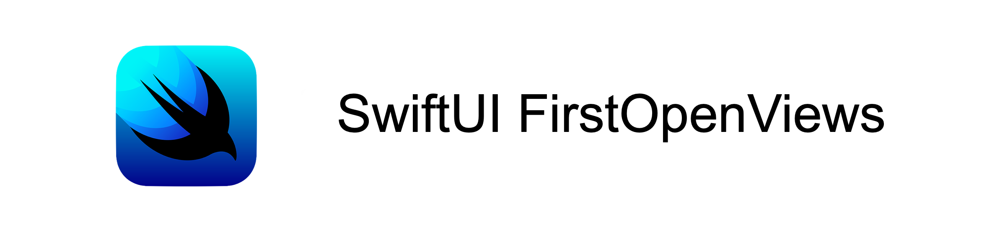

======================================

[](https://github.com/LucasMucGH/FirstOpenViews/releases)
[](https://github.com/LucasMucGH/FirstOpenViews/blob/main/LICENSE)
[](https://github.com/LucasMucGH/FirstOpenViews/issues)

A sheet to introduce the user to your app and to welcome them or to inform them about new features after an update.

- [Why](#why) 
- [Requirements](#requirements) 
- [Installation](#installation)
- [Usage](#usage) 
- [Parameters](#parameters)
- [Examples](#examples)
- [Contributing](#contributing)
- [License](#license)
- [Credits](#credits)

# Why

Apple uses it in all of their apps, but unfortunately they don't make it available to us in their SDK. That's why I have my own implementation and make it available, as I have hardly found another good one on github.

# Requirements 

- iOS 13
- Swift 5.3
- Xcode 12

# Installation

The preferred way of installing FirstOpenViews is via the [Swift Package Manager](https://swift.org/package-manager/).

>Xcode 11 integrates with libSwiftPM to provide support for iOS, watchOS, and tvOS platforms.

1. In Xcode, open your project and navigate to **File** → **Swift Packages** → **Add Package Dependency...**
2. Paste the repository URL (`https://github.com/LucasMucGH/FirstOpenViews`) and click **Next**.
3. For **Rules**, select **Branch** (with branch set to `main`).
4. Click **Finish**.

# Usage

## Basic Usage

**WARNING:**
This is Sample Code for visualisation where and how to use, without a working initializer. Please see [Examples](#examples) for working code

Same way you use Sheet in SwiftUI

### Life Cycle: UIKit App Delegate (IOS 13+)

````swift
//SceneDelegate.swift

func scene(_ scene: UIScene, willConnectTo session: UISceneSession, options connectionOptions: UIScene.ConnectionOptions) {
    let contentView = ContentView() //1
                                    .welcomeView() //2
                                    .whatsNewView() //3

    if let windowScene = scene as? UIWindowScene {
        let window = UIWindow(windowScene: windowScene)
        window.rootViewController = UIHostingController(rootView: contentView)
        self.window = window
        window.makeKeyAndVisible()
    }
}
````

### Life Cycle: SwiftUI App (IOS 14+)

````swift
@main
struct TestApp: App {
    var body: some Scene {
        WindowGroup {
            ContentView() //1
                .welcomeView() //2
                .whatsNewView() //3
        }
    }
}
````

`//1` You add it to the highest Navigation Level

`//2` This is how you add the WelcomeView (first launch)

`//3` This is how you add the WhatsNewView (after update)

# Parameters

## WelcomeView

**WARNING:**
This is Sample Code for visualisation of the parameters and their default values and value types, without a working initializer. Please see [Examples](#examples) for working code

````swift
.welcomeView(
    imageName: String? = nil,
    mainColor: Color = Color.blue,
    informationDetailViews: [InformationDetailView]
)
````

- `imageName`
  Here you can add a image to the sheet if you wish.

- `mainColor`
  Here you can change the color used for the App Name and the Continue Button.
  
- `informationDetailViews`
  Here you add the InformationDetailView's. Three are recommend. Please see [InformationDetailView](#InformationDetailView) for parameters.
  
## WhatsNewView

**WARNING:**
This is Sample Code for visualisation of the parameters and their default values and value types, without a working initializer. Please see [Examples](#examples) for working code

````swift
.whatsNewView(
    imageName: String? = nil,
    mainColor: Color = Color.blue,
    informationDetailViews: [InformationDetailView]
)
````

- `imageName`
  Here you can add a image to the sheet if you wish.

- `mainColor`
  Here you can change the color used for the App Name and the Continue Button.
  
- `informationDetailViews`
  Here you add the InformationDetailView's. Three are recommend. Please see [InformationDetailView](#InformationDetailView) for parameters.

## InformationDetailView

**WARNING:**
This is Sample Code for visualisation of the parameters and their default values and value types, without a working initializer. Please see [Examples](#examples) for working code

````swift
InformationDetailView(
    title: String,
    subTitle: Sring,
    image: Image,
    mainColor: Color = Color.blue
)
````

- `title`
  The title for the view
  
- `subTitle`
  The text for the view

- `image`
  Here you add the picture for the View. SFSymbols are preferred.

- `mainColor`
  Here you can change the color of the picture if it is an SFSymbol.

# Examples

## Life Cycle: UIKit App Delegate (IOS 13+)

````swift
import UIKit
import SwiftUI

class SceneDelegate: UIResponder, UIWindowSceneDelegate {

    var window: UIWindow?

    func scene(_ scene: UIScene, willConnectTo session: UISceneSession, options connectionOptions: UIScene.ConnectionOptions) {
    
        let contentView = ContentView()
            .welcomeView(informationDetailViews: [
                InformationDetailView(title: "Car", subTitle: "A car (or automobile) is a wheeled motor vehicle used for transportation.", image: Image(systemName: "car.fill")),
                InformationDetailView(title: "Airplane", subTitle: "An airplane or aeroplane (informally plane) is a powered, fixed-wing aircraft that is propelled forward by thrust from a jet engine, propeller or rocket engine.", image: Image(systemName: "airplane")),
                InformationDetailView(title: "Tram", subTitle: "A tram (in North America streetcar or trolley) is a rail vehicle that runs on tramway tracks along public urban streets.", image: Image(systemName: "tram.fill"))
            ])
            .whatsNewView(informationDetailViews: [
                InformationDetailView(title: "Car", subTitle: "A car (or automobile) is a wheeled motor vehicle used for transportation.", image: Image(systemName: "car.fill")),
                InformationDetailView(title: "Airplane", subTitle: "An airplane or aeroplane (informally plane) is a powered, fixed-wing aircraft that is propelled forward by thrust from a jet engine, propeller or rocket engine.", image: Image(systemName: "airplane")),
                InformationDetailView(title: "Tram", subTitle: "A tram (in North America streetcar or trolley) is a rail vehicle that runs on tramway tracks along public urban streets.", image: Image(systemName: "tram.fill"))
            ])

        if let windowScene = scene as? UIWindowScene {
            let window = UIWindow(windowScene: windowScene)
            window.rootViewController = UIHostingController(rootView: contentView)
            self.window = window
            window.makeKeyAndVisible()
        }
    }

    func sceneDidDisconnect(_ scene: UIScene) {}

    func sceneDidBecomeActive(_ scene: UIScene) {}

    func sceneWillResignActive(_ scene: UIScene) {}

    func sceneWillEnterForeground(_ scene: UIScene) {}

    func sceneDidEnterBackground(_ scene: UIScene) {}
}
````

## Life Cycle: SwiftUI App (IOS 14+)

````swift
import SwiftUI

@main
struct TestApp: App {
    var body: some Scene {
        WindowGroup {
            ContentView()
                .welcomeView(informationDetailViews: [
                    InformationDetailView(title: "Car", subTitle: "A car (or automobile) is a wheeled motor vehicle used for transportation.", image: Image(systemName: "car.fill")),
                    InformationDetailView(title: "Airplane", subTitle: "An airplane or aeroplane (informally plane) is a powered, fixed-wing aircraft that is propelled forward by thrust from a jet engine, propeller or rocket engine.", image: Image(systemName: "airplane")),
                    InformationDetailView(title: "Tram", subTitle: "A tram (in North America streetcar or trolley) is a rail vehicle that runs on tramway tracks along public urban streets.", image: Image(systemName: "tram.fill"))
                ])
                .whatsNewView(informationDetailViews: [
                    InformationDetailView(title: "Car", subTitle: "A car (or automobile) is a wheeled motor vehicle used for transportation.", image: Image(systemName: "car.fill")),
                    InformationDetailView(title: "Airplane", subTitle: "An airplane or aeroplane (informally plane) is a powered, fixed-wing aircraft that is propelled forward by thrust from a jet engine, propeller or rocket engine.", image: Image(systemName: "airplane")),
                    InformationDetailView(title: "Tram", subTitle: "A tram (in North America streetcar or trolley) is a rail vehicle that runs on tramway tracks along public urban streets.", image: Image(systemName: "tram.fill"))
                ])
        }
    }
}
````

# Contributing

FirstOpenViews welcomes contributions in the form of GitHub issues and pull-requests.

# License

FirstOpenViews is available under the MIT license. See [the LICENSE file](LICENSE) for more information.

# Credits

FirstOpenViews is a project of [@LucasMucGH](https://github.com/LucasMucGH).
